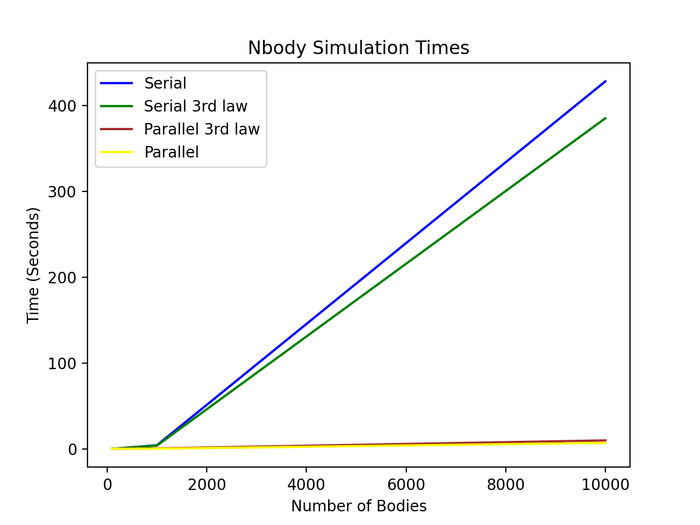
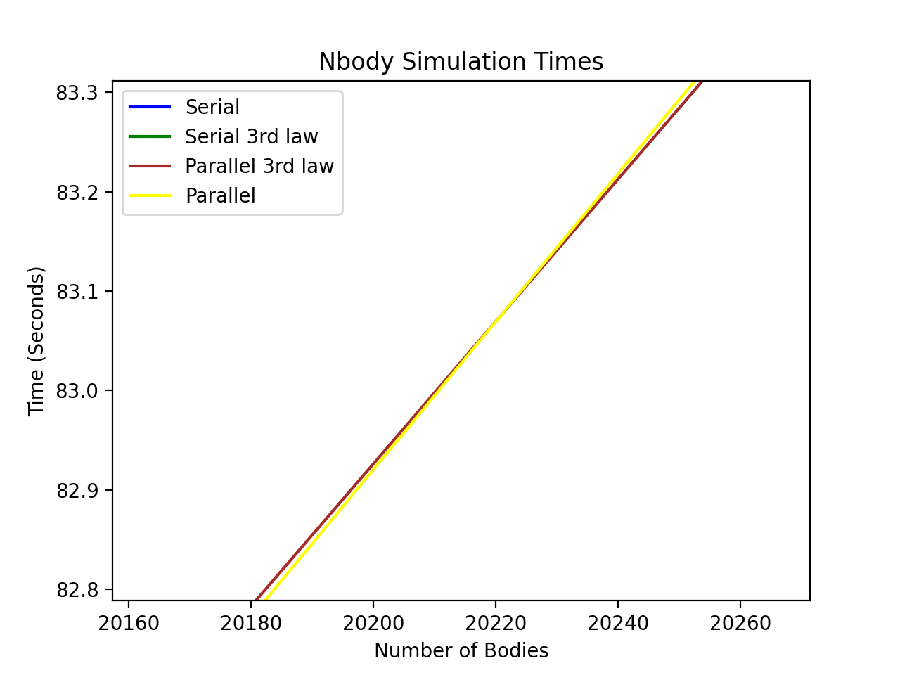

# Analysis
### Mark Morykan and Jonah Beers

 

__Run Times:__  Each value is the minimum time in seconds after 3 runs.
|  Program  | random100  | random1000 | random10000 | random100000 | 
|   :---:   |    :---:   |    :---:   |    :---:    |    :---:     |  
| nbody-s   |  0.043376  |  4.277198  | 428.023792  |      -       |    
| nbody-s3  |  0.038930  |  3.870915  | 385.049920  |      -       |     
| nbody-p   |  0.148911  |  0.234163  | 6.989153    |  676.968151  |       
| nbody-p3  |  0.224911  |  0.603614  | 9.888036    |  654.340123  |        
   

* We removed the times for 100,000 bodies from this graph because only the parallel programs were ran with this number of bodies.

 

__Speedup and Efficiencies Using Amdahl's Law:__
|       Program      | random100 | random1000 | random10000 | 
|        :---:       |   :---:   |    :---:   |    :---:    |
| Speedup Naïve      |    29%    |   1827%    |    6124%    |
| Speedup 3rd Law    |    17%    |    641%    |    3894%    |  
| Efficiency Naïve   |   -247%   |   95.3%    |    99.1%    |      
| Efficiency 3rd Law |   -492%   |   85.1%    |    98.2%    |
 

__Trends and Scalability:__

* When you have a small number of bodies (<120), both serial programs will be faster then the parallel programs. As the number of bodies increases, the speedups of the parallel programs increase as well.
* The programs are strongly scalable because as you increase the number of bodies and cores, the speedup eventually stays consistent. 

  

__Crossover Points:__ These are the points where the parallel programs become faster then the serial programs.
|            Program          |  Crossover Point (Bodies)  | 
|             :---:           |           :---:            |
| Serial & Parallel           |            122             | 
| Serial & Parallel (3rd Law) |            148             | 
 

* Naïve serial is never faster than serial 3rd Law.
* Naïve parallel is faster than parallel 3rd Law after about 20,220 bodies.

